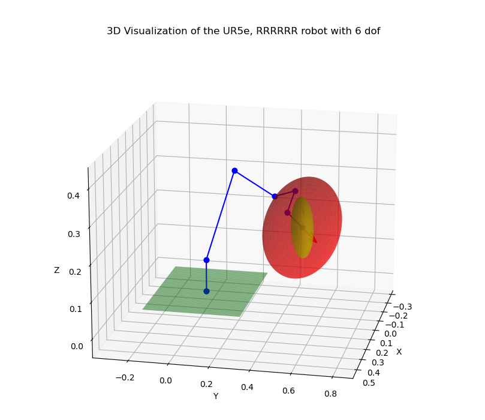

# RoboKitPy
## Robotics toolbox in Python


<!---[](https://badge.fury.io/py/roboticstoolbox-python)
[](https://anaconda.org/conda-forge/roboticstoolbox-python)

-->
[](https://opensource.org/licenses/MIT)

<table style="border:0px">
<tr style="border:0px">
<td style="border:0px">
</td>
<td style="border:0px">
<ul>
<li><a href="https://github.com/foiegreis/robokitpy>GitHub repository </a></li>
</ul>
</td>
</tr>
</table>

<!-- <br> -->

## Contents

- [RoboKitPy](#1)
- [Installation](#2)
- [Tutorials](#3)
- [Code Examples](#4)

<br>

<a id='1'></a>

## RoboKitPy

[...]

This package was created in parallel with my website www.roboticsunveiled.com

<br>

<a id='2'></a>

## Installation

Requirements: Python >= 3.6

### Using pip

```shell script
pip3 install robokitpy
```

### From GitHub

```shell script
git clone https://github.com/foiegreis/robokitpy.git
cd robokitpy
pip3 install -e .
```

<br>

<a id='3'></a>

## Tutorials
The [`examples`](https://github.com/foiegreis/robokitpy/tree/main/robokitpy/examples) folder contains some examples on the functionalities of the package. 

<br>

<a id='3'></a>

## Code Examples

We will load a model of the Franka-Emika Panda robot defined by a URDF file

```python
from robokitpy.core.fk import *
from robokitpy.models.spatial.ur5e import UR5e

# UR5e
# Known joint configuration θ1-θ6
theta = [0.7854, -0.7854, 0.7854, -1.5708, -1.5708, 0.7854]

# Model
model = UR5e()

# FK DH
dh_table = model.DH(theta)

# FORWARD KINEMATICS applying DH
fk_dh = fk_dh(dh_table)
print(f"\nForward Kinematics T0{dh_table.shape[0]} applying DH for the configuration {theta}: \n{fk_dh}")

# FK POE
M = model.M()
s_list = model.S()
b_list = model.B()

# FORWARD KINEMATICS applying PoE SPACE FORM
fk_s = fk_space(M, s_list, theta)
print(f"\nForward Kinematics T0{s_list.shape[0]} applying PoE Space Form for the configuration {theta}: \n{fk_s}")

# FORWARD KINEMATICS applying PoE BODY FORM
fk_b = fk_body(M, b_list, theta)
print(f"\nForward Kinematics T0{b_list.shape[0]} applying PoE Space Form for the configuration {theta}: \n{fk_b}")
```

This code will return the forward kinematics of the UR5e robot, given the joint configuration:

```
Forward Kinematics T06 applying DH for the configuration [0.7854, -0.7854, 0.7854, -1.5708, -1.5708, 0.7854]: 
[[-0.     -1.      0.      0.4798]
 [-1.      0.      0.      0.6339]
 [ 0.     -0.     -1.      0.3075]
 [ 0.      0.      0.      1.    ]]

Forward Kinematics T06 applying PoE Space Form for the configuration [0.7854, -0.7854, 0.7854, -1.5708, -1.5708, 0.7854]: 
[[ 0.     -1.      0.      0.4798]
 [-1.      0.      0.      0.6339]
 [ 0.     -0.     -1.      0.3075]
 [ 0.      0.      0.      1.    ]]

Forward Kinematics T06 applying PoE Space Form for the configuration [0.7854, -0.7854, 0.7854, -1.5708, -1.5708, 0.7854]: 
[[ 0.     -1.      0.      0.4798]
 [-1.      0.      0.      0.6339]
 [ 0.     -0.     -1.      0.3075]
 [ 0.      0.      0.      1.    ]]

```

For the inverse kinematics, the code will have a similar fashion:

```python
from robokitpy.core.ik import *
from robokitpy.models.spatial.ur5e import UR5e

# Desired end-effector pose
Tsd = np.array([[ 0, -1, 0, 0.4798],
                 [-1, 0, 0, 0.6339],
                 [ 0, 0, -1, 0.3075],
                 [ 0, 0, 0, 1]])
# Initial guess
thetalist0 = np.array([np.pi/4, -np.pi/4, np.pi/4, -np.pi/4, -np.pi/4, np.pi/4])

# Thresholds
eps_w = 0.001
eps_v = 0.0001

# model
model = UR5e()
M = model.M()
s_list = model.S()
b_list = model.B()

max_iterations = 20

# INVERSE KINEMATICS applying PoE SPACE FORM
ik_s, success = ik_space(M, s_list, Tsd, thetalist0, eps_w, eps_v, max_iterations)
print(f"\nInverse kinematics in Space form: \n{ik_s}")
print("success: ", success)

# INVERSE KINEMATICS applying PoE BODY FORM
ik_b, success = ik_body(M, b_list, Tsd, thetalist0, eps_w, eps_v, max_iterations)
print(f"\nInverse kinematics in Body form: \n{ik_b}")
print("success: ", success)

print("\nExpected result:\n",  np.round([np.pi/4, -np.pi/4, np.pi/4, -np.pi/2, -np.pi/2, np.pi/4], 8))
```

That will result in:

```shell
Inverse kinematics in Space form: 
[ 0.78546815 -0.78537123  0.78525326 -1.57096848 -1.57078516  0.78542622]
success:  True

Inverse kinematics in Body form: 
[ 0.78536466 -0.78552649  0.78560546 -1.57116855 -1.5708196   0.78532415]
success:  True

Expected result:
 [ 0.78539816 -0.78539816  0.78539816 -1.57079633 -1.57079633  0.78539816]
```

We can also plot the robot, showing the Velocity (Manipulability) and Force Ellipsoids

```python
from robokitpy.models.spatial.ur5e import UR5e
from robokitpy.plot.plot_3d import *

thetalist = np.array([np.pi/4, -np.pi/4, np.pi/4, np.pi/4, -np.pi/4, np.pi/4])

model = UR5e()

plot_robot_3d(model, thetalist, velocity_ellipsoid=False, force_ellipsoid=True, linear=False, scale=0.1)
```
That will generate this 3D plot


<p align="center">
	
</p>


