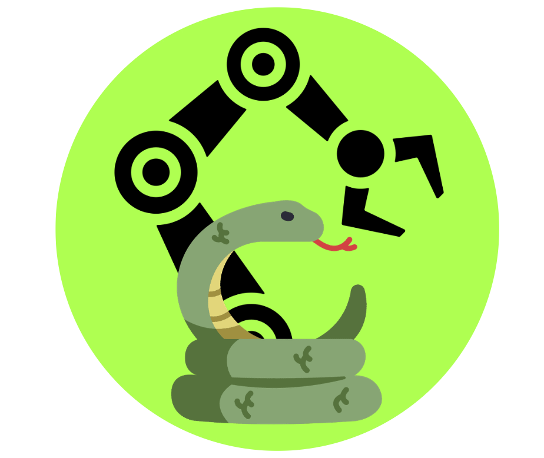
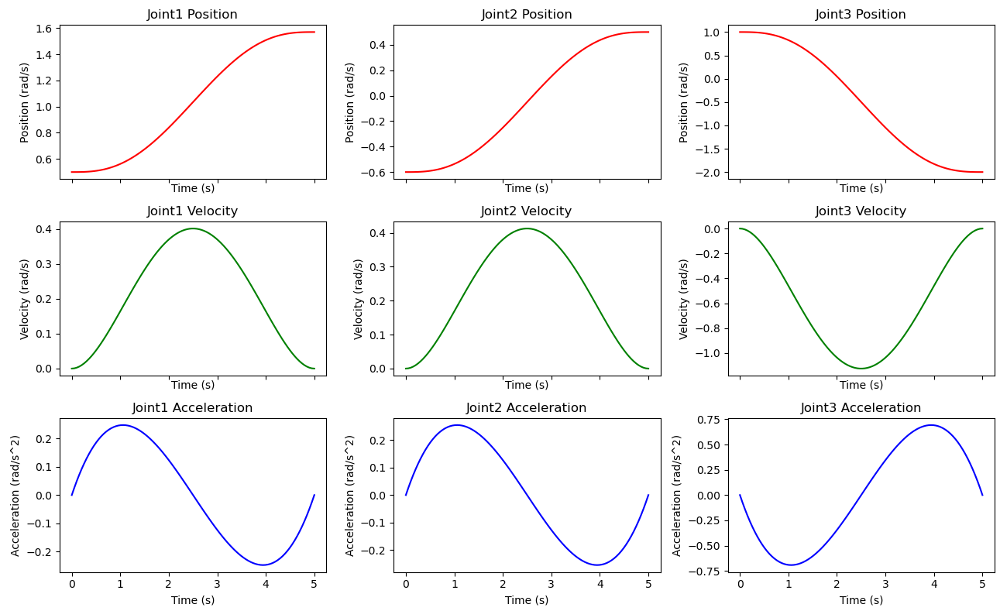

# RoboKitPy
**Robotics toolbox in Python**

[](https://opensource.org/licenses/MIT)

<p align="center">
	
</p>


## Contents

- [RoboKitPy](#1)
- [Installation](#2)
- [Tutorials](#3)
- [Code Examples](#4)

<br>
<a id='1'></a>

## RoboKitPy

**RoboKitPy** is an open-source Python library designed to bridge the gap between theoretical robotics concepts and practical application. The repository serves as a comprehensive toolkit for both students and professionals, facilitating an easier understanding of complex robotics topics through well-documented and executable Python code.

### Current Features
RoboKitPy currently supports a wide range of functionalities centered around the core areas of robotics:

- **Forward Kinematics**: Compute the position and orientation of the robot's end-effector based on given joint parameters.
- **Inverse Kinematics**: Determine the joint parameters necessary to achieve a desired end-effector position and orientation.
- **Differential Forward Kinematics**: Analyze the velocity relationships between joint velocities and end-effector velocities, featuring the calculation of manipulability and force ellipsoids to assess the performance and capability of robotic manipulators.
- **Statics**: Handle the static balance and force transmission within robotic structures.
- **Dynamics**: Determine the Inverse and Forward Dynamics using the Newton-Euler approach.
- **Trajectory Generation**: Algorithms for smooth trajectory planning for open-chain robots.

### Supported Robotic Models
The library includes implementations for various robotic configurations, both planar and spatial, making it versatile for different educational and research needs:

- Planar Robots: 
  - RR 
  - RRR 
- Spatial Robots:
  - RRR and RRR Coplanar configurations
  - Puma560
  - PRRRRP
  - UR5e

### Upcoming Features
RoboKitPy is actively being developed with future updates aimed at expanding its capabilities:

- **Motion Planning and Obstacle Avoidance**: Enhanced algorithms for navigating through complex environments.
- **Behavioral Planning**: Integration of decision-making processes in robotic tasks.
- **SLAM**: Tools for robotic mapping and navigation in unknown environments.
- **Mobile Robots**: Expanding the library to include autonomous ground vehicles.
- **Navigation, Sensor Fusion, and Perception**: Advanced modules for robust robotic perception and interaction with the environment. 

### Educational Companion
RoboKitPy runs in parallel with theoretical posts and tutorials available at my website https://www.roboticsunveiled.com.

<p align="center">
	
</p>

### Contribution and Community
We welcome contributions from the community to help grow RoboKitPy and make robotics more accessible to a broader audience. Whether you're interested in adding new models, improving existing algorithms, or providing educational content, your input is valuable.

<br>
<a id='2'></a>

## Installation

Requirements: Python >= 3.6

### Using pip

**Coming Soon**
```shell script
pip3 install robokitpy
```

### From GitHub

```shell script
git clone https://github.com/foiegreis/RoboKitPy.git
cd robokitpy
pip3 install -e .
```

<br>
<a id='3'></a>

## Tutorials
The [`examples`](https://github.com/foiegreis/RoboKitPy/tree/main/robokitpy/examples) folder contains some tutorials on the functionalities of the package. 

<br>
<a id='4'></a>

## Code Examples

Let's see some examples of the functionalities provided by the code.

### Forward Kinematics
Starting with the Forward Kinematics:

```python
from robokitpy.core.kinematics import *
from robokitpy.models.spatial.ur5e import UR5e

# UR5e
# Known joint configuration θ1-θ6
theta = [0.7854, -0.7854, 0.7854, -1.5708, -1.5708, 0.7854]

# Model
model = UR5e()

# FK DH
dh_table = model.DH(theta)

# FORWARD KINEMATICS applying DH
fk_dh = fk_dh(dh_table)
print(f"\nForward Kinematics T0{dh_table.shape[0]} applying DH for the configuration {theta}: \n{fk_dh}")

# FK POE
M = model.M()
s_list = model.S()
b_list = model.B()

# FORWARD KINEMATICS applying PoE SPACE FORM
fk_s = fk_space(M, s_list, theta)
print(f"\nForward Kinematics T0{s_list.shape[0]} applying PoE Space Form for the configuration {theta}: \n{fk_s}")

# FORWARD KINEMATICS applying PoE BODY FORM
fk_b = fk_body(M, b_list, theta)
print(f"\nForward Kinematics T0{b_list.shape[0]} applying PoE Space Form for the configuration {theta}: \n{fk_b}")
```

This code will return the forward kinematics of the UR5e robot, given the joint configuration:

```
Forward Kinematics T06 applying DH for the configuration [0.7854, -0.7854, 0.7854, -1.5708, -1.5708, 0.7854]: 
[[-0.     -1.      0.      0.4798]
 [-1.      0.      0.      0.6339]
 [ 0.     -0.     -1.      0.3075]
 [ 0.      0.      0.      1.    ]]

Forward Kinematics T06 applying PoE Space Form for the configuration [0.7854, -0.7854, 0.7854, -1.5708, -1.5708, 0.7854]: 
[[ 0.     -1.      0.      0.4798]
 [-1.      0.      0.      0.6339]
 [ 0.     -0.     -1.      0.3075]
 [ 0.      0.      0.      1.    ]]

Forward Kinematics T06 applying PoE Space Form for the configuration [0.7854, -0.7854, 0.7854, -1.5708, -1.5708, 0.7854]: 
[[ 0.     -1.      0.      0.4798]
 [-1.      0.      0.      0.6339]
 [ 0.     -0.     -1.      0.3075]
 [ 0.      0.      0.      1.    ]]

```

### Inverse Kinematics
For the inverse kinematics, the code will have a similar fashion:

```python
from robokitpy.core.kinematics import *
from robokitpy.models.spatial.ur5e import UR5e

# Desired end-effector pose
Tsd = np.array([[ 0, -1, 0, 0.4798],
                 [-1, 0, 0, 0.6339],
                 [ 0, 0, -1, 0.3075],
                 [ 0, 0, 0, 1]])
# Initial guess
thetalist0 = np.array([np.pi/4, -np.pi/4, np.pi/4, -np.pi/4, -np.pi/4, np.pi/4])

# Thresholds
eps_w = 0.001
eps_v = 0.0001

# model
model = UR5e()
M = model.M()
s_list = model.S()
b_list = model.B()

max_iterations = 20

# INVERSE KINEMATICS applying PoE SPACE FORM
ik_s, success = ik_space(M, s_list, Tsd, thetalist0, eps_w, eps_v, max_iterations)
print(f"\nInverse kinematics in Space form: \n{ik_s}")
print("success: ", success)

# INVERSE KINEMATICS applying PoE BODY FORM
ik_b, success = ik_body(M, b_list, Tsd, thetalist0, eps_w, eps_v, max_iterations)
print(f"\nInverse kinematics in Body form: \n{ik_b}")
print("success: ", success)

print("\nExpected result:\n",  np.round([np.pi/4, -np.pi/4, np.pi/4, -np.pi/2, -np.pi/2, np.pi/4], 8))
```

That will result in:

```shell
Inverse kinematics in Space form: 
[ 0.78546815 -0.78537123  0.78525326 -1.57096848 -1.57078516  0.78542622]
success:  True

Inverse kinematics in Body form: 
[ 0.78536466 -0.78552649  0.78560546 -1.57116855 -1.5708196   0.78532415]
success:  True

Expected result:
 [ 0.78539816 -0.78539816  0.78539816 -1.57079633 -1.57079633  0.78539816]
```

### Velocity (Manipulability ) and Force Ellipsoids
Finally, we plot the robot showing the Velocity (Manipulability) and Force Ellipsoids

```python
from robokitpy.models.spatial.ur5e import UR5e
from robokitpy.plot.plot_3d import *

thetalist = np.array([np.pi/4, -np.pi/4, np.pi/4, np.pi/4, -np.pi/4, np.pi/4])

model = UR5e()

plot_robot_3d(model, thetalist, velocity_ellipsoid=False, force_ellipsoid=True, linear=False, scale=0.1)
```
That will generate this 3D plot


<p align="center">
	
</p>

### Trajectory Generation

Now we see an example of generating and plotting trajectories for a RRR robot.

The available trajectories profiles are Trapezoidal, Cubic Polynomial and Quintic Polynomial

The following code generates and plots a quintic polynomial Point-To-Point trajectory for the RRR robot

```python

import numpy as np
from robokitpy.models.spatial.rrr import RRR
from robokitpy.plot.plot_3d_trajectories import PlotTrajectory
from robokitpy.core.trajectory import generate_p2p_trajectory

""" Example of generating a point-to-point trajectory for a 3D RRR robot, and plotting the robot in 3D"""

if __name__ == '__main__':

    model = RRR()

    # Initial and Final Joint Angles
    q0 = np.array([0.5, -0.6, 1.0])
    qf = np.array([1.57, 0.5, -2.0])

    t0 = 0
    tf = 5
    N = 100

    # For trapezoidal trajectory ------------
    max_vel = 2
    acc_time = 2
    dec_time = 2
    # --------------------------------------

    trajectory_type = 'quintic'
    trajectory = generate_p2p_trajectory(trajectory_type, q0, qf, t0, tf, N,
                                     max_vel=max_vel, acc_time=acc_time, dec_time=dec_time,
                                     plot=True)

    plot_robot = PlotTrajectory(model, q0, qf)
    plot_robot.plot_robot_trajectory(trajectory)


```
<p align="center">
	
</p>

<p align="center">
	
</p>

While the following code generates and plots a quintic polynomial Viapoint trajectory for the RRR robot


```python
import numpy as np
from robokitpy.models.spatial.rrr import RRR
from robokitpy.plot.plot_3d_trajectories import PlotTrajectory
from robokitpy.core.trajectory import generate_viapoint_trajectory

""" Example of generating a viapoint trajectory for a 3D RRR robot, and plotting the robot in 3D"""

if __name__ == '__main__':

    model = RRR()

    # Initial and Final Joint Angles
    q0 = np.array([0.5, -0.6, 1.0])
    qf = np.array([1.57, 0.5, -2.0])

    # Intermediate waypoints
    via_points = [np.array([1.0, -0.2, 0.8]), np.array([1.4, 0.0, 0.0])]

    t0, tf = 0, 8
    N = 100
    # for trapezoidal trajectory
    max_vel = 2
    acc_time = 2
    dec_time = 2

    trajectory_type = 'quintic'
    trajectory = generate_viapoint_trajectory(trajectory_type, q0, qf, via_points, t0, tf, N,
                                               max_vel=max_vel, acc_time=acc_time, dec_time=dec_time,
                                               plot=True)

    plot_robot = PlotTrajectory(model, q0, qf, via_points)
    plot_robot.plot_robot_trajectory(trajectory)


```
<p align="center">
	
</p>

<p align="center">
	
</p>

In the same fashion, we compute a viapoint trajectory for the UR5e robot


```python
import numpy as np
from robokitpy.models.spatial.ur5e import UR5e
from robokitpy.plot.plot_3d_trajectories import PlotTrajectory
from robokitpy.core.trajectory import generate_viapoint_trajectory

""" Example of generating a viapoint trajectory for a 3D UR5e robot, and plotting the robot in 3D"""

if __name__ == '__main__':

    model = UR5e()

    # Initial and Final Joint Angles
    q0 = [0.0, -np.pi / 2, np.pi / 2, -np.pi / 2, -np.pi / 2, 0.0]
    qf = [np.pi / 2, -np.pi / 4, np.pi / 4, -np.pi / 2, np.pi / 2, -np.pi / 2]

    # Define via-points
    via_points = [
        [np.pi / 6, -np.pi / 3, np.pi / 4, -np.pi / 3, -np.pi / 3, np.pi / 6],  # Via-point 1
        [np.pi / 4, -np.pi / 6, np.pi / 6, -np.pi / 4, -np.pi / 6, np.pi / 4],  # Via-point 2
        [np.pi / 3, -np.pi / 4, np.pi / 5, -np.pi / 5, -np.pi / 4, np.pi / 3]  # Via-point 3
    ]

    t0, tf = 0, 8
    N = 100
    # for trapezoidal trajectory
    max_vel = 2
    acc_time = 2
    dec_time = 2

    trajectory_type = 'quintic'
    trajectory = generate_viapoint_trajectory(trajectory_type, q0, qf, via_points, t0, tf, N,
                                               max_vel=max_vel, acc_time=acc_time, dec_time=dec_time,
                                               plot=True)

    plot_robot = PlotTrajectory(model, q0, qf, via_points)
    plot_robot.plot_robot_trajectory(trajectory)


```
<p align="center">
	
</p>
