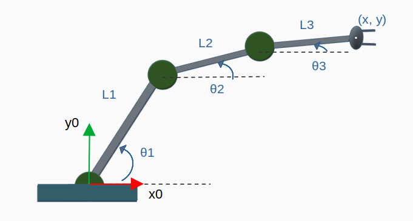
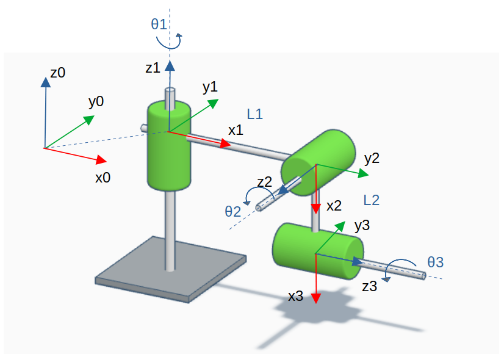
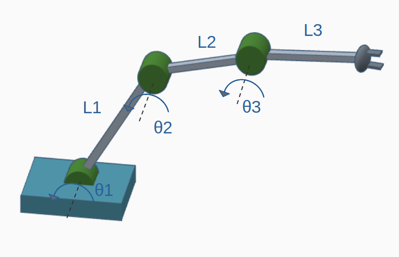
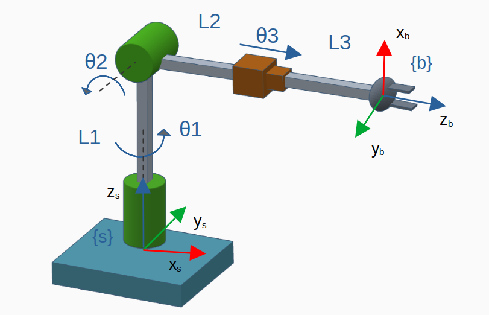
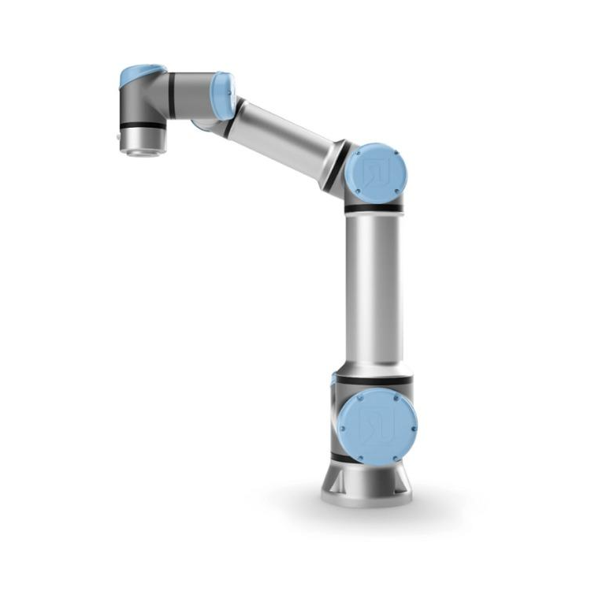
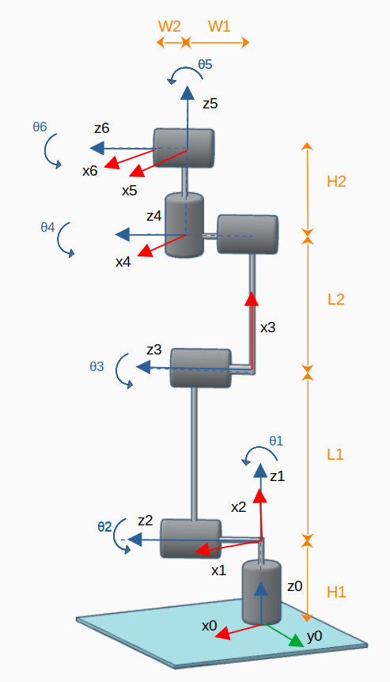
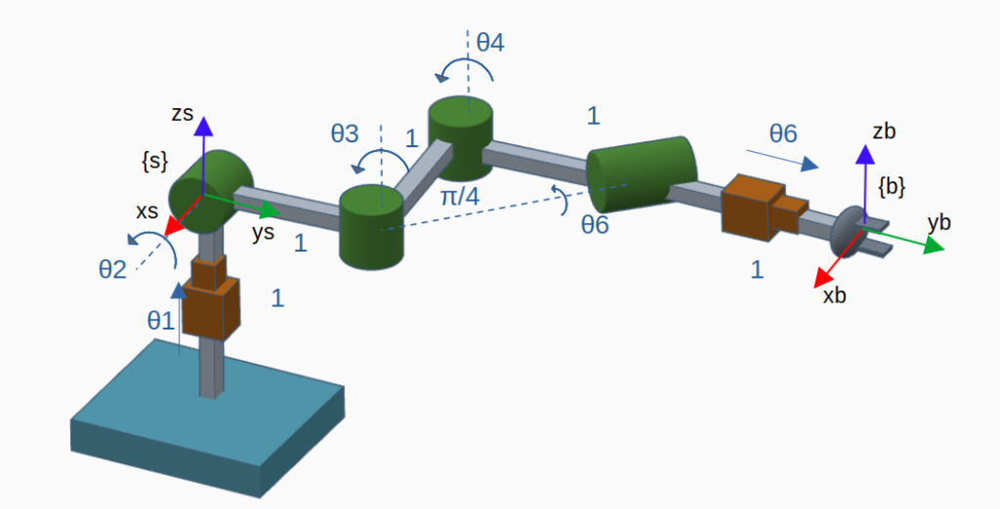

# RoboKitPy Models

The following models of Planar and Spatial robots are available
- [File Structure](#0)
- [Planar](#1)
  - [RR](#11)
  - [RRR](#12)
- [Spatial](#2)
  - [RRR](#21)
  - [RRR coplanar](#22)
  - [RRP](#23)
  - [UR5e](#24)
  - [PRRRP](#25)

<br>
<a id='0'></a>

## File Structure

The model files have the following structure:

Planar (geometric models):
```python

class PlanarRobot:
    def __init__(self):

        self.name = ""
        self.joints_num = None
        self.joints_type = ""

        self._L1 = None
        self._L2 = None
        #[...]

    @property
    def L1(self):
        return self._L1

    @property
    def L2(self):
        return self._L2

    @L1.setter
    def L1(self, value):
        assert isinstance(value, int)
        self._L1 = value

    @L2.setter
    def L2(self, value):
        assert isinstance(value, int)
        self._L2 = value

    def fk(self, thetalist):
        """
        Forward Kinematics
        """
        pass
    
    def joints(self, thetalist):
        """
        Joint positions
        """
        pass

    def jacobian(self, thetalist):
        """
        Jacobian matrix
        """
        pass

```

Spatial:
```python
class Robot(ABC):
    def __init__(self):
        self.name = None
        self.joints_num = None
        self.joints_type = None

    @abstractmethod
    def M(self):
        """
        Abstract method to return the home configuration matrix of the robot.
        """
        pass

    @abstractmethod
    def S(self):
        """
        Abstract method to return the screw axis of the robot.
        """
        pass

    @abstractmethod
    def B(self):
        """
        Abstract method to return the body-fixed screw axes.
        """
        pass

    @abstractmethod
    def DH(self, thetalist):
        """
        Abstract method to return Denavit-Hartenberg parameters | alpha - a - d - phi  |
.
        """
        pass
```

<br>
<a id='1'></a>

# Planar Robots

This package comprises the following planar robots models

- [RR](#11)
- [RRR](#12)

<br>
<a id='11'></a>

## RR
<p align="center">
	
</p>

<br>
<a id='12'></a>

## RRR 
<p align="center">
	
</p>

# Spatial Robots

This package comprises the following spatial robots models

- [RRR](#21)
- [RRR coplanar](#22)
- [RRP](#23)
- [UR5e](#24)
- [PRRRP](#25)

<br>
<a id='21'></a>

## RRR 
<p align="center">
	
</p>

<br>
<a id='22'></a>

## RRR coplanar
<p align="center">
	
</p>

<br>
<a id='23'></a>

## RRP 
<p align="center">
	
</p>

<br>
<a id='24'></a>

## UR5e
<p align="center">
	
</p>

<p align="center">
	
</p>

<br>
<a id='25'></a>

## PRRRRP
<p align="center">
	
</p>

