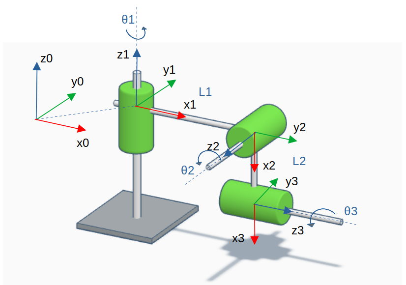
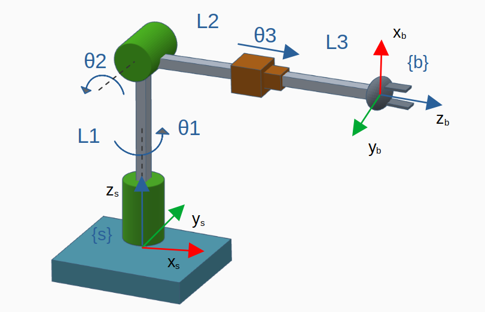
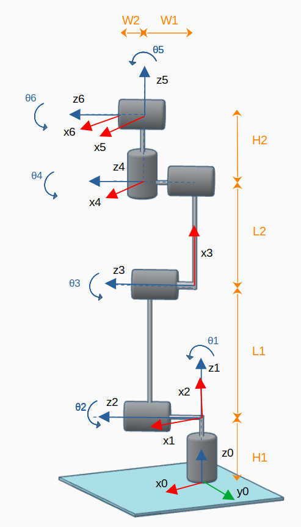

# Spatial Robots

This package comprises the following spatial robots models

- [RRR](#1)
- [RRR coplanar](#2)
- [RRP](#3)
- [UR5e](#4)
- [PRRRP](#5)

 

## RRR 

	

 

## RRR coplanar

	

 

## RRP 

	

 

## UR5e

	

	

 

## PRRRRP

	

